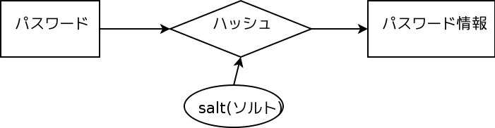

パスワードの話
--------------------------------------
* 自己紹介
* パスワードの保存
* パスワードの話題いろいろ
* まとめ

TODO: s5での体裁

.. raw:: pdf

    PageBreak

自己紹介
=============================================================

* ECナビ システム本部 春山征吾 `@haruyama <https://twitter.com/#!/haruyama>`_
* セキュリティ

  * OpenSSH (本x2, `OpenSSH情報 <http://www.unixuser.org/~haruyama/security/openssh/>`_)
  * `暗号技術大全 <http://www.sbcr.jp/products/4797319119.html>`_ 

    * 18章(ハッシュ), 20章(電子署名)翻訳担当

* 全文検索システム Apache Solrの勉強会開催

.. raw:: pdf

    PageBreak

資料
======================================

* 本資料

  * http://haruyama.github.com/445_14_20101211/

    * http://bit.ly/fJP5du
    * http://goo.gl/fKzJ5

  * PDF版

    * http://haruyama.github.com/445_14_20101211/index.pdf

.. raw:: pdf

    PageBreak

本講演の経緯
======================================

* `第1回神泉セキュリティ勉強会 <http://atnd.org/events/8398>`_ にて, パスワードの保存(10分)の話を講演
* `@ikepyon <http://twitter.com/ikepyon>`_ さんから講演の依頼

  * 時間は1時間

* ご要望を満たすために 「パスワードの保存」の話をして, その後その他のテーマの話をします.

.. raw:: pdf

    PageBreak

参考文献
==========================

man 3 crypt 

  `Manpage of CRYPT <http://www.linux.or.jp/JM/html/LDP_man-pages/man3/crypt.3.html>`_
  
CRYPTOGRAPHY ENGINEERING

  ISBN-13: 978-0470474242

認証技術 パスワードから公開鍵まで

  ISBN-13: 978-4274065163

.. raw:: pdf

    PageBreak

パスワードの保存
======================================

* 最初に
* パスワード保存の常識(?)
* Unix的パスワード保存

  * 概要
  * ハッシュ
  * salt(ソルト)
  * stretching

* Webシステムでのパスワード保存

.. raw:: pdf

    PageBreak

最初に
======================================

パスワード情報が漏れたときに, 
パスワード(特に *弱いパスワード* )を破られにくくする方法を話します.

もちろん, 以下が望ましいです.

* パスワード情報が漏れないこと
* ユーザが強いパスワードを付けること 
  
.. raw:: pdf

    PageBreak

パスワード保存の常識(?)
======================================

パスワードの保存は, 

「salt(ソルト)を付けてハッシュ」

とよく言われている.

.. raw:: pdf

    PageBreak

パスワード保存の常識(?)
======================================

* パスワード情報からはパスワードは復元困難
* ログイン時の照合は, 
  パスワードと同様に入力を処理して パスワード情報を照合

常識(?)の元になったのは Unixのパスワード保存法だと思われる

.. raw:: pdf

    PageBreak

Unix的パスワード保存
=============================================================

GNU/Linuxの場合 

* /etc/shadow にパスワード情報を保存

形式: $id$salt$hashed

* id: ハッシュ(後述)の識別子

  * 1 => MD5, 5 => SHA-256 6 => SHA-512

* salt: ソルト, お塩
* hashed: ハッシュ化されたパスワード情報

.. raw:: pdf

    PageBreak

ハッシュとは?
==========================================

`暗号学的ハッシュ関数 - Wikipedia <http://ja.wikipedia.org/wiki/%E6%9A%97%E5%8F%B7%E5%AD%A6%E7%9A%84%E3%83%8F%E3%83%83%E3%82%B7%E3%83%A5%E9%96%A2%E6%95%B0>`_ より(一部変更)

* 与えられたメッセージに対してハッシュ値を 容易に計算できる。
* ハッシュ値から元のメッセージを得ることが 事実上不可能であること。

  * *一方向性*
 
* *衝突耐性* を持つこと

* 例: MD5, SHA1, SHA-256,512

.. raw:: pdf

    PageBreak

salt(ソルト, お塩)とは?
==========================================

* ハッシュ化のときに, パスワードと共に入力される文字列

    * ハッシュの値をかきまぜる「お塩」(調味料).

* ユーザごとに異なるsalt(ソルト)が必要

.. raw:: pdf

    PageBreak

なぜ salt は必要なのか
==========================================

レインボーテーブルを利用した攻撃が可能になる

* `レインボーテーブル <http://ja.wikipedia.org/wiki/%E3%83%AC%E3%82%A4%E3%83%B3%E3%83%9C%E3%83%BC%E3%83%86%E3%83%BC%E3%83%96%E3%83%AB>`_

  * ハッシュ値から平文が得られるテーブル

    * ある文字数(以下)の英数文字列に対するテーブル
    * ありがちなパスワードの辞書に対するテーブル
    * ...

.. raw:: pdf

    PageBreak

レインボーテーブルやその利用例
===================================================

  * `Free Rainbow Tables » Distributed Rainbow Table Generation » LM, NTLM, MD5, SHA1, HALFLMCHALL, MSCACHE <http://www.freerainbowtables.com/>`_

  * `Ophcrack <http://ophcrack.sourceforge.net/>`_

    * レインボーテーブルを利用した Windowsのパスワードクラックツール

.. raw:: pdf

    PageBreak

レインボーテーブルのデモ
===================================================
  * `Free Rainbow Tables <http://www.freerainbowtables.com/>`_ のテーブルを利用

.. raw:: pdf

    PageBreak

なぜ salt はユーザ毎に違う必要があるか
==========================================

* ユーザに共通のsaltを用いると
  同じパスワードを利用する人に対して
  同じパスワード情報が生成されてしまう

* ユーザごとに異なる必要がある
    
  * ランダムでなくてもよい

.. raw:: pdf

    PageBreak

saltのサイズ
==========================================

* 伝統的なunix: 12bit(4096通り)
  
  * 12bitでは小さすぎて, レインボーテーブルが存在

* 現在のGNU/Linux: 96bit
* CRYPTOGRAPHY ENGINEERING: ハッシュのサイズ

  * SHA-256なら256bit

.. raw:: pdf

    PageBreak

実際の処理
==========================================

* CRYPTOGRAPHY ENGINEERING p304 の方式 

.. admonition:: PHP風の言語で記述

 | $x = '';                                     
 | for($i = 0; $i < $iter; ++$i) {
 |   $x = hash($x . $password . $salt);
 | }

.. raw:: pdf

    PageBreak

実際の処理(2)
==========================================

* `[ crypt() アルゴリズム解析 (MD5バージョン) ] <http://ruffnex.oc.to/kenji/xrea/md5crypt.txt>`_

* `phpass - Portable PHP password hashing ("password encryption") framework <http://www.openwall.com/phpass/>`_

どれも, ハッシュを繰り返し利用している

* *stretching*

.. raw:: pdf

    PageBreak

stretching とは?
======================================================

* ハッシュを繰り返し利用することで, ハッシュ値を求めるのに必要な時間を増大させる

  * 攻撃に時間がかかるようになる

    * 実質的にパスワード文字数を伸ばす (stretchする)効果

* どれくらい繰り返されているか

  * crypt() MD5の場合: 1000回
  * crypt() SHA-256,512の場合: (デフォルト)5000回
  * CRYPTOGRAPHY ENGINEERING での例: 
    2^20(約100万)回

.. raw:: pdf

    PageBreak

stretching の効果(1)
======================================================

PHPの hash 拡張で SHA-256を繰り返し呼ぶコードを用いた計測をした

* 方式は CRYPTOGRAPHY ENGINEERING のもの
* パスワード 10byte
* salt 32byte
* CPU 1コアのみ利用

Intel(R) Core(TM) i7 CPU 860  @ 2.80GHz で 1秒に SHA-256を約50万回計算できた.

.. raw:: pdf

    PageBreak

stretching の効果(2)
======================================================

* パスワードの文字種を64種とすると
  
======= =============================
文字数  総パスワード数
======= =============================
n       64^n
3        26万
4        1677万
5        10億
6        687億
7        4兆
8        281兆
======= =============================

.. raw:: pdf

    PageBreak

stretching の効果(3)
======================================================

1CPU(8コア)のPCでパスワード解析する場合を考察

* 1日3456億回 計算可能

  * stretching がないと...
    
    * 6文字が 0.2日,  7文字が 13日

  * 1000回 stretching すると

    * 1日3.5億回パスワードを計算可能

    * 5文字が 3日, 6文字だと 199日

.. raw:: pdf

    PageBreak
    
stretching の効果(4)
======================================================

MD5だと...
Intel(R) Core(TM) i7 CPU 860  @ 2.80GHz (1コアのみ利用)で 1秒に 約140万回計算できた.

* (私のPCでは)SHA-256の約3倍速い

  * 同じ回数 stretching しても3倍弱い

* stretching の強度は, (回数) x (1回あたりの実行時間) で考えなければならない

.. raw:: pdf

    PageBreak
    
方式の保存
==============================================

現在は問題なくても, 将来問題になるかもしれない

* ハッシュ関数自体
* ハッシュ化の方法
* stretching 回数

長く運用するシステムでは, パスワード保存方式を パスワード情報と共に保存する必要がある.

.. raw:: pdf

    PageBreak
    

なぜUnixはこの方式なのか?
==============================================

* なぜ可逆な暗号化ではないのか?
    
  * 鍵を管理するのが難しい. 
  
    * 1つの物理的マシンで完結させるためには
      パスワード情報と鍵を同じマシンで管理
      しなければならない
    
    * 以下からパスワード情報と鍵が漏れるかもしれない

      * バックアップファイル
      * システムの脆弱性
      * 別のOSでブート
      * ...

.. raw:: pdf

    PageBreak

Unix的パスワード保存まとめ
==============================================

* パスワードはハッシュ化して保存

  * この時 salt と stretching を利用

* メリット

    * 鍵管理が不要
    * 生パスワードを復元できない

* デメリット

    * 弱いパスワードが記録された情報だけで破れる

      * stretching である程度対処できる

.. raw:: pdf

    PageBreak

Webシステムでは?
===========================================

* パスワード情報と鍵を別に管理可能

  * 例: 鍵がWebサーバ, 情報がDBサーバ

  * Unixよりもパスワード情報と鍵が 共に漏洩するリスクは小さくできる

* 鍵を適切に利用すれば 攻撃者が鍵を入手できない場合 鍵の強度 == パスワード情報の強度となる

    * パスワードの強さに関係ない

  * ただし, 鍵管理のコストは無視できない

    * 漏洩, 改竄, 紛失....

.. raw:: pdf

    PageBreak

Webシステムでのリスク
===========================================

パスワード情報の保存に関するリスクのみ

* SQLインジェクションなどによる (表側からの)パスワード情報の漏洩
* バックアップファイル, 実サーバ, 廃棄サーバなどの (裏側からの)パスワード情報の漏洩
* 開発者/運用者によるパスワード情報の漏洩/悪用

  * 開発者はプログラムで処理する生パスワードを
    閲覧可能なことに注意

.. raw:: pdf

    PageBreak

鍵を用いる場合の手法案
===========================================

* 共通鍵暗号
* ハッシュ + 暗号
* 鍵付きハッシュ

.. raw:: pdf

    PageBreak

共通鍵暗号
===========================

共通鍵暗号をハッシュ的に用いる パスワード保存法もあるが, ここではパスワード情報を暗号化する場合を考察

* メリット

  * 鍵が漏れなければ, 弱いパスワードもパスワード情報だけでは破れない

* デメリット

  * 鍵があればパスワードを復元できる
  * 鍵の管理の必要がある

.. raw:: pdf

    PageBreak

ハッシュ+暗号
===========================

Unix的にハッシュ化したあとで暗号化

* メリット

  * 鍵が漏れなければ, 弱いパスワードもパスワード情報だけでは破れない
  * 鍵を保持するものでも生パスワードを復元できない

* デメリット

  * 鍵の管理の必要がある

.. raw:: pdf

    PageBreak

鍵付きハッシュ(1)
===========================

鍵情報とパスワードを組合せてハッシュ

* saltの一部を鍵に?

  * 単純に鍵と平文を文字列連結をしたものをハッシュ するMAC(メッセージ認証コード)は 期待通りの強度がないという論文

    `On the Security of Two MAC Algorithms <http://www.cix.co.uk/~klockstone/twomacs.p
    df>`_

* hash($key . $salt . $password) などはMACとして用いないほうがよい.

  * パスワード保存の場合では関係ないと思われるが, あえて利用する理由はない
    

.. raw:: pdf

    PageBreak

鍵付きハッシュ(2)
===========================

* HMACには前述の問題はない

  * CRAM-MD5はHMACを元にした パスワード情報保持をしている.

    * チャレンジレスポンス認証用の情報保持なので, 
      応用していいかは不明

.. raw:: pdf

    PageBreak

鍵付きハッシュ(3)
===========================

* メリット

  * ちゃんとしたアルゴリズムを用いて鍵が安全ならば, 弱いパスワードも記録された情報だけでは破れない
    
    * 「ちゃんと」しているかは「ちゃんと」した人に 確認してほしい
                      
  * 鍵を保持するものでも生パスワードを復元できない

* デメリット

  * 鍵の管理の必要がある

.. raw:: pdf

    PageBreak

パスワード保存方式の比較
===========================================

==============================   ==================================   ============================  =================
方式                              弱いパスワードの保護                         生パスワード                     鍵管理
==============================   ==================================   ============================  =================
そのまま保存                      不可能                                   そのまま                                 不必要
Unix的                            stretching で対応                            復元不可能                               不必要
暗号                                 可能                                 復元可能                                必要
ハッシュ+暗号                     可能                                    復元不可能                             必要
鍵+ハッシュ                       可能                                    復元不可能                             必要
==============================   ==================================   ============================  =================

個人的には, Webシステムにおいても
鍵の管理が面倒なのでUnix的でよいと考えています.

.. raw:: pdf

    PageBreak

パスワードの保存 まとめ
======================================

* Unix的パスワード保存を解説

* Webシステムでのパスワード保存を考察

.. raw:: pdf

    PageBreak

パスワードの話題いろいろ
==========================

* 私のパスワード管理法
* 強度
* 定期更新
* マスキング
* 秘密の質問
* リマインダ
* フレームワークのパスワード管理法
* 攻撃

後のほうほど質が下がります...

.. raw:: pdf

    PageBreak

私のパスワード管理法(1)
==========================

* すべてのパスワードは違う
* 求められなければ更新しない

* パスワードを3つにレベル分け

  * 手で入力しなければならないもの
  * 重要なもの
  * 重要でないもの

* パスワード管理ソフトを利用

  * `KeePass Password Safe <http://keepass.info/>`_

.. raw:: pdf

    PageBreak

手で入力しなければならないもの
===================================================

* ローカルPCのパスワード
* SSH秘密鍵のパスフレーズ
* パスワード管理ソフトのパスワード

10〜20文字のパスワードを作成して覚える

* 頻繁には入力しないものについては
  パスワード管理ソフトにも記録

.. raw:: pdf

    PageBreak

重要なもの
==========================

* お金のからむサービスのパスワード
* 会社のサーバのパスワード
  (sudoに必要)

10〜30文字のパスワードを
パスワード管理ソフトで作成して
*覚えない*

* ブラウザなどには記録しない

  * パスワード管理ソフトからコピペ

.. raw:: pdf

    PageBreak

重要でないもの
==========================

* メールのパスワード
* お金のからまないサービスのパスワード

10〜30文字のパスワードを
パスワード管理ソフトで作成して
*覚えない*

* ブラウザなどに記録する

  * ブラウザのマスターパスワードは利用していない

.. raw:: pdf

    PageBreak

パスワードの強度(1)
==========================

文字種を増やすのがよいか, 長さを増やすのがよいか?

.. raw:: pdf

    PageBreak

パスワードの強度(2)
==========================

============== ======= =============================
文字種         文字数  総パスワード数
============== ======= =============================
62(英数)         8         218兆
96(英数記号)     8         7213兆
62(英数)         9        13537兆
62(英数)         10       839299兆
============== ======= =============================

* 文字長を伸ばしたほうがいい.

  * 記号を入れることを強制するよりも 最小の文字長を大きくしたほうがよい.

.. raw:: pdf

    PageBreak

パスワードの定期更新(1)
==================================

パスワードを定期的に更新する意味はあるのか?

.. raw:: pdf

    PageBreak

パスワードの定期更新(2)
==================================

`パスワードの変えどき - When to Change Passwords 日本語訳 <http://www.yamdas.org/column/technique/passwordj.html>`_

* 通常は意味がない. むしろ有害

  * 定期的に変えても強度はあまり増えない.

    * `続パスワードの定期変更は神話なのか - ockeghem(徳丸浩)の日記 <http://d.hatena.ne.jp/ockeghem/20101209/p1>`_

    * `パスワード定期変更云々 - pochi-pの日記 <http://d.hatena.ne.jp/pochi-p/20090830#p1>`_

  * パスワードの変更により打ち間違えが増え
    利便性が下がる
      

.. raw:: pdf

    PageBreak

パスワードの定期更新(3)
==================================

* 意味がある場合

  * 共有アカウントで, 人員の入れ替えが頻繁にある場合

    * 定期更新によって権限がない人のアクセスを
      止めれる
    * セキュリティ的には共有アカウント でないほうがよい

  * パスワード情報がじっくりと解析される場合

    * shadow化される前のUnixのパスワード

.. raw:: pdf

    PageBreak

パスワードのマスキング
==================================

* ショルダークラック
  vs
  利便性

  * 要件に依存する

* 個人的にはユーザが切り替えられるのがいいと思う

.. raw:: pdf

    PageBreak

秘密の質問
==========================

* 弊社の例: 
  重要な機能(ポイント交換)を行なう前に 秘密の質問を入力させている

  * ユーザがサイトごとに別々の強いパスワードを
    付けてくれれば, 必要ないのだが...

* よくあるのは小学校の名前とか親の旧姓とか

  * 他者が推測可能なものがある...

* 個人的には第2パスワードとか
  交換用パスワードなどと呼んで, 
  普通のパスワードと同じように管理してもらうほうが
  いいのではと考えている

.. raw:: pdf

    PageBreak

パスワードリマインダ
===========================

* 見たことがある方式

  * メールで変更用一時URLを通知
  * メールで新規パスワードを通知
  * メールで既存パスワードを通知
  * 秘密の質問に答えられたら再発行

* 秘密の質問はやめたほうがよい

.. raw:: pdf

    PageBreak

パスワードリマインダ(2)
===========================

* パスワード忘れちゃったユーザについては, メールの安全性は信用するしかないよね!

  * 一般には一時URLが推奨されているが, ユーザが良いパスワードを付けてくれない可能性が 高いのなら新規パスワードがいいのかも
  * 一時URLの場合, 他のURLの推測を困難にしなければならない

.. raw:: pdf

    PageBreak

フレームワークのパスワード管理法(1)
=================================================================================

* `[PHP]オープンソースのパスワードハッシュ化状況調査 | ブログが続かないわけ <http://en.yummy.stripper.jp/?eid=734747>`_
* `オープンソースCMSでのパスワードの ハッシュ化方法を調べてみた - ”improve it!” (IT四重奏) <http://d.hatena.ne.jp/uunfo/20090521/1242901642>`_
* `CakePHPの暗号化ハッシュデフォルトは、SAH1 - CPA-LABテクニカル <http://www.cpa-lab.com/tech/063>`_
* `sfGuardPlugin(3.0.0) PluginsfGuardUser.php - symfony <http://trac.symfony-project.org/browser/plugins/sfGuardPlugin/tags/RELEASE_3_0_0/lib/model/plugin/PluginsfGuardUser.php>`_

  * 4.0.1でもこの部分は同様

.. raw:: pdf

    PageBreak

フレームワークのパスワード管理法(2)
=================================================================================

* Rails

  * `lib/authentication/by_password.rb (restful-authentication) <https://github.com/technoweenie/restful-authentication/blob/master/lib/authentication/by_password.rb>`_

  * `lib/clearance/user.rb (clearance) <https://github.com/thoughtbot/clearance/blob/master/lib/clearance/user.rb>`_

.. raw:: pdf

    PageBreak

パスワードに対する攻撃
==========================

* 総当たり攻撃
* 辞書攻撃
* レインボーテーブル

----
  
* ショルダークラック
* キーロガー

----

* 別のサイトと共通のパスワードを利用しているユーザ

  * 他のサイトでパスワードが漏れて, ログインされる

.. raw:: pdf

    PageBreak

まとめ
===========================
* パスワードの保存について考察

* パスワードの話題をいろいろ

なにかご質問は?

.. raw:: pdf

    PageBreak

