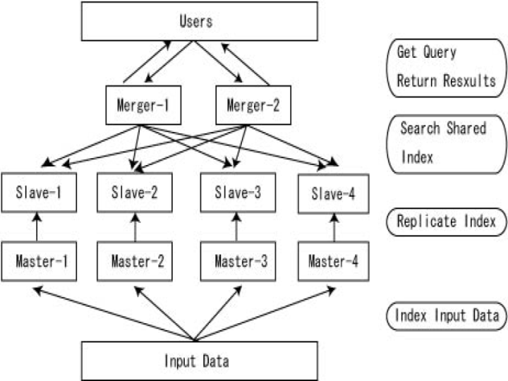
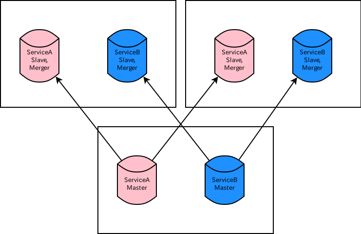
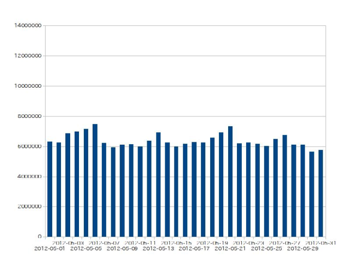
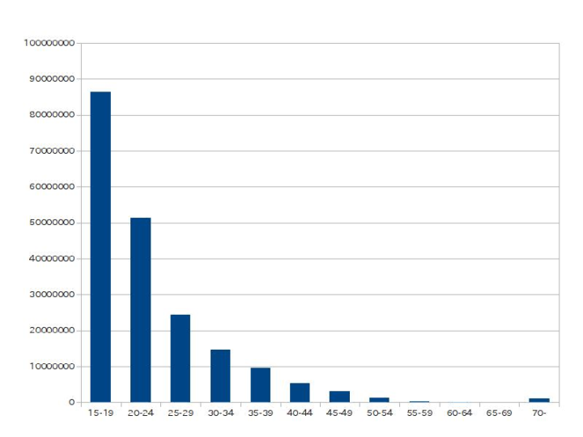
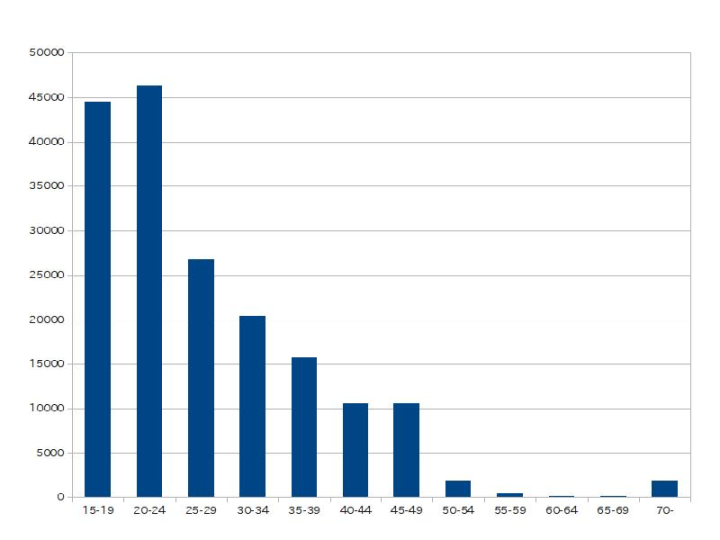

# Using Solr in mixi.

##

## [#SolrJP 8th.](http://atnd.org/events/29826)

##

##

##

##

##

##

##

mixi, Inc.

System H.Q., Tech Div., R & D Group.

HARUYAMA Seigo([@haruyama](https://twitter.com/haruyama))

[日本語](index.html) / [English](index.en.html)

# Self Introduction

* [@haruyama](https://twitter.com/haruyama)
* I have been using [Apache Solr](http://lucene.apache.org/solr/) from 2008.
* I joined mixi Inc. on 2011/10.

# Using Solr in mixi.

* Full-Text Search
* Text Mining

# Full-Text Search in mixi

We adopted following solutions before 2011 (and now use them).

* [Hyper Estraier](http://fallabs.com/hyperestraier/index.html)
* [Tokyo Dystopia](http://fallabs.com/tokyodystopia/)
* [Senna](http://qwik.jp/senna/FrontPageJ.html)

we have been constructing and renewing search systems using Solr, since 2011.

# Anuenue

Our open-source product(Apache Licence 2.0).

* [anuenue-wrapper - A Search Package with Apache Solr](https://code.google.com/p/anuenue-wrapper/)

a Solr wrapper, which can build Master-Slave Full-Text Search System.

* ([@takahi_i](https://twitter.com/takahi_i?partner=mozilla&source=mobile-bar))(Now in PFI) created and developed.
* Now HARUYAMA develops and maintains.

# Anuenue : Logical composition

# Anuenue: History

* Anuenue 0.3.x
    * first release. Solr 1.4. Sen/Kuromoji.
* Anuenue 0.5.x
    * fully refactoring.
* Anuenue 0.6.x
    * Solr 3.x. lucene-gosen/Kuromoji.
* Anuenue 0.7.x
    * Optimizing and bug fixes.

We use Anuenue 0.7.x in mixi.

# Search Systems using Anuenue in mixi

* mixi page
* mixi application/game
* diary
* future release
    * community
    * topics in communities
    * (We are going to substitute Anuenue for all Hyper Estraier/Tokyo Dystopia.)

We also use Anuenue for search systems in our office.

# Anuenue in mixi : Physical composition

We use 1 Master and 2 Slave(and Merger) servers on our most systems.

Features of our typical search system.

* Index size: around 10GB (on memory!)
* Query per second: under 100.

And we share physical servers with 2 or 3 services.

# Physical composition: Figure

# Future goal

* Log analysis(like [soleami](http://soleami.com/))
* Personalized search
    * for example: Ranking using user's and friend's 'like's
        * Join (Solr 4)
        * Custom Function Query which retrieves data from external storage(next page)
* Features of general search systems
    * for example: Suggestion.

# Custom Function Query which retrieves data from external storage

* Personalized Data, such as 'like', are real-time and big.
    * They are not suitable to index in Solr?
* Can we refer data on external storage(for example: memcached) using Function Query?
    * [FunctionQuery - Solr Wiki](https://wiki.apache.org/solr/FunctionQuery)
    * [haruyama/solr-function-query-sample · GitHub](https://github.com/haruyama/solr-function-query-sample)
        * We can do it! (functionally)

* We didn't test its capability.
    * At an actual service, we would probably restrict numbers of retrieving per 1 Solr Query.

# Custom Function Query: Figure

# Custom Function Query: Demo

Demo on my machine.

* http://localhost:8983/solr/select/?q=*%3A*&indent=on&sort=dist_between_users%281,%20id%29%20desc&fl=id

# Text mining using Solr

* Our group were often consulted about mining data of mixi Voice.
    * We dumped data and analyzed them many times....
* Let's index data to Solr!

# Number of documents and Index size

* posts(documents): over 10 million per day.
* Solr Index Size: over 4GB per day.

We keep indexes for the last 102 days in 600GB SSD.

* over 11 billion documents.
* about 450GB

# Softwares

* Solr 4.0 (at 2012/01/??)
* lucene-gosen 1.2.1
* Filters which I made (by Scala)
    * [haruyama/solr-filter - GitHub](https://github.com/haruyama/solr-filter)

# Fields in Document

* body
* post time
* number of favorites
* number of comments
* age
* sex
* place of residence
* ...
* Dynamic Fields
    ＊ temporary field for A/B Testing

# Sample: number of posts on 2012/05

# number of women's posts on 2012/05

# number of men's posts on 2012/05

# facet of age to women's posts on 2012/05

# facet of age to men's posts on 2012/05

# facet of age to women's posts including 'AKB' on 2012/05

# facet of age to men's posts including 'AKB' on 2012/05

# Composition

# Why is index for last 1-day separated?

* We can calculate summaries for 1 day quickly.
* mergeIndexes faster than updates full index.
    * mergeIndexes only moves files and rewrites segments.* .
    * updating causes merging indexes.

* It takes about 1 minute to faceting to all documents.
    * If a query is specified (such as 'body:AKB'), it takes a few seconds.

# Expansion

* Positive/Negative analysis
* burst keyword

# Positive/Negative analysis

* We can do Positive/Negative analysis.
    * We built a word-score dictionary.
        * Part of speech: adj., pictogram and face mark
* How to build a dictionary
    * iterate the following procedure
        * get documents from Solr randomly.
        * extract words (adj., pictogram and face mark)
        * score documents by existing dictionary
        * adjust the scores of documents manually
        * score words using classifier and make a word-score dictionary.
        * adjust the dictionary manually
* How to classify a given word
    * get documents(A) from Solr randomly.
    * get documents(B) from Solr using a given word
    * score documents(A and B) by a dictionary
    * chisq test between A and B

# Positive/Negative Analysis: Score Ranking

* Positive
    * かわいい
    * おもしろい
    * 懐かしい
    * 素晴らしい
    * 偉い
* Negative
    * おそい
    * ダサい
    * 遠慮ない
    * 痒い
    * あぶない

# Burst Keyword

* extract burst morphemes which have high chisq values (per day)
* concatenate morphemes around a burst morpheme
* concatenations which have high frequencies are burst keywords.

* At mixi Voice, most burst keywords come from mixi News.

# Burst Keyword: 3/23

* シンデレラ城で結婚式が可能に~TDL初の園内ウエディングプラン発表
    * from mixi News.
* ルパン VS コナン

# burst keyword: 5/21

* 日食グラス
* 金環日食
* 300年後
* 綺麗だった
* 日食メガネ

# Future goal

* extend a period
    * We want analyze documents over 1 year.
* provide an usable GUI(Web Application)

# Summary

* mixi uses Solr for Full-Text Search and Text Mining.
