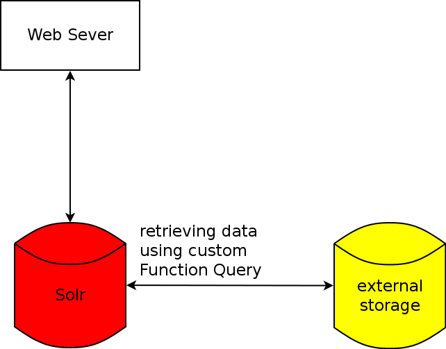
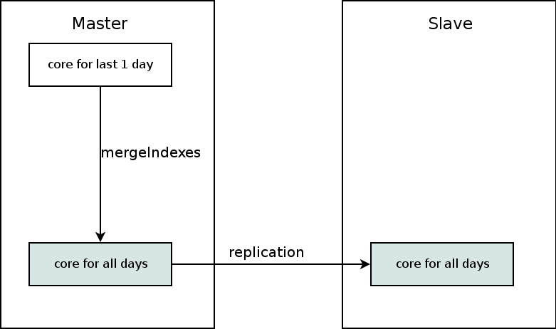

# mixi での Solr の利用

##

## [第8回 Solr勉強会](http://atnd.org/events/29826)

##

##

##

##

##

##

##

株式会社ミクシィ

システム本部技術部研究開発グループ

春山 征吾([@haruyama](https://twitter.com/haruyama))

[日本語](index.html) / [English](index.en.html)

# 自己紹介

* [@haruyama](https://twitter.com/haruyama)
* 2008年6月より [Apache Solr](http://lucene.apache.org/solr/) を利用
* 2011年10月に 株式会社ミクシィに入社

# mixi での Solr の利用シーン

* 全文検索
* テキストマイニング

# mixi の全文検索

2011年以前は以下のソリューションを採用していた.

* [Hyper Estraier](http://fallabs.com/hyperestraier/index.html)
* [Tokyo Dystopia](http://fallabs.com/tokyodystopia/)
* [Senna](http://qwik.jp/senna/FrontPageJ.html)

2011年以降はSolr を利用して, 新規案件の検索システムの構築や既存案件の検索システムの置換を行なっている.

# Anuenue

ミクシィで作成したオープンソース製品(Apache Licence 2.0)

* [anuenue-wrapper - A Search Package with Apache Solr](https://code.google.com/p/anuenue-wrapper/)

Master-Slave構成の全文検索システムを構築できる Solr の ラッパー

* 現PFI の 伊藤 ([@takahi_i](https://twitter.com/takahi_i?partner=mozilla&source=mobile-bar))さんが作成.
* 現在 春山が開発/保守

# Anuenue : 論理的な構成

# Anuenue の進化

* Anuenue 0.3 系
    * 最初のリリース系統. Solr 1.4 ベース. Sen/Kuromoji を利用.
* Anuenue 0.5 系
    * リファクタリング.
* Anuenue 0.6 系
    * Solr 3.x に更新. lucene-gosen を採用.
* Anuenue 0.7 系
    * 更新の高速化. バグ修正.

現在 mixi 内で利用しているのは 0.7系.

# Anuenue を利用している mixi の検索

* mixiページ検索
* mixiアプリ/ゲーム検索
* 日記検索
* 未リリース
    * コミュニティ検索
    * トピック検索
    * (すべての Hyper Estraier, Tokyo Distopia なシステムを置き換える予定)

他に 内部用の全文検索システムでも採用している.

# Anuenue in mixi : 物理的な構成

たいがいのシステムでは, 1 Master, 2 Slave(兼Marger)構成.

mixi の典型的なシステムは以下のような特徴.

* インデックスサイズが 〜10GB
* QPS が 100 以下

さらに, 2〜3個の検索システムを 物理サーバに相乗りさせている

# 物理的な構成 : 図

# 今後やりたいこと

* ログ分析([soleami](http://soleami.com/)的な)
* パーソナライズ
    * ユーザやユーザの友人のイイネ!などを元にしたランキング
        * Solr 4 以降の Join
        * 外部ストレージを参照するカスタム関数クエリ(次ページ)
* もしかして, など一般的な検索エンジンの機能

# 外部ストレージを参照するカスタム関数クエリ

* イイネ! などのパーソナライズ用の情報はリアルタイムに更新されたりデータ量が多いなど Solr に持たせないほうがよいかも
* これらの情報は memcached などに持たせて, 関数クエリで参照させられないか
    * [FunctionQuery - Solr Wiki](https://wiki.apache.org/solr/FunctionQuery)
    * [haruyama/solr-function-query-sample · GitHub](https://github.com/haruyama/solr-function-query-sample)
        * 機能としては問題なく動くことは確認した.

* どれくらい性能がでるかはまだ測定していない
    * 検索結果が一定件数以下のクエリのみに適用するなど, 工夫が必要かも.

# カスタム関数クエリ: イメージ

# カスタム関数クエリ: デモ

手元の環境でのデモ

* http://localhost:8983/solr/select/?q=*%3A*&indent=on&sort=dist_between_users%281,%20id%29%20desc&fl=id

# テキストマイニング

* mixiボイスのマイニングをしたいという話がちょくちょく来る
    * その度にダンプして解析...
* じゃあ, 全部 Solr にのっけちゃえばよくない?

# mixiボイスの投稿数

* 1日あたり 1000万強
* 1日分の Solr のインデックスが 4GB強.

600GB のSSD に 102日分保持するようにした.

* 約 11億文書
* 約 450GB

# 利用ソフトウェア

* Solr 4.0(2012/01ごろの)
* lucene-gosen 1.2.1
* 自作のフィルタ(Scala製)
    * [haruyama/solr-filter - GitHub](https://github.com/haruyama/solr-filter)
        * 特定の品詞を抽出するフィルタ
        * lucene-gosen付属のものとほぼ同じ / 機能的な違いはサ変動詞も抽出可能にした

# Solrに入れているデータ

* ボイス/コメント本文
* 投稿日時
* イイネ数
* ボイスに付いたコメント数
* 年齢
* 性別
* 居住地
* ...
* Solr の Dynamic Field を用いて一時的に要素を足すこともある
    * ABテスト用フラグ

# 集計サンプル: 5月の投稿数

# 集計サンプル: 5月の女性の投稿数

# 集計サンプル: 5月の男性の投稿数

# 集計サンプル: 5月の女性 年代別

# 集計サンプル: 5月の男性 年代別

# 5月の女性 年代別 「AKB」

# 5月の男性 年代別 「AKB」

# 構成

# なぜ 1日分のインデックスを別にしているか

* 1日分だけの集計を高速にしたいことがある
* 直接入れるより 1日分を mergeIndexes したほうが速い.
    * mergeIndexes は ファイルの移動と segments.* を書き換えるだけ.
    * 通常の update では merge が発生する
* この構成で, 全文書に対する Facet を行なうと1分くらいかかる.
    * 検索クエリを指定するともっと短くなる

# 拡張

* ポジネガ分析
* バーストキーワード

# ポジネガ分析

* 形容詞/絵文字/顔文字にスコアが付いた辞書を作成してポジネガ分析でできるようにした.
    * 形容詞 > 絵文字 > 顔文字の順で効く
* 辞書作成手法
    * 次の作業を繰り返す
        * Solr から文書をランダムに取得
        * 特定の品詞のみ抽出
        * 既存のポジネガ辞書から文書にスコア付ける
        * 手で調整
        * 分類器で学習し辞書作成
        * 手で調整
* キーワードを指定していないときとした場合で, ポジ/ネガのカイ二乗検定

# ポジネガ分析: スコアランキング

* ポジ
    * かわいい
    * おもしろい
    * 懐かしい
    * 素晴らしい
    * 偉い
* ネガ
    * おそい
    * ダサい
    * 遠慮ない
    * 痒い
    * あぶない

# バーストキーワード

* 日別に, カイ二乗値の高いバースト形態素を抽出
* バースト形態素周辺の形態素をつなげる
* この繋げたものが高い頻度を持っていたらバーストキーワード.

* mixiボイスではmixiニュースに関するつぶやきが盛り上がることが多い.

# バーストキーワード: 3/23

* シンデレラ城で結婚式が可能に~TDL初の園内ウエディングプラン発表
    * mixiニュース経由
* ルパン VS コナン

# バーストキーワード: 5/21

* 日食グラス
* 金環日食
* 300年後
* 綺麗だった
* 日食メガネ

# やりたいこと

* 期間の延長
    * 1年以上やりたい
* 社内向けに使いやすいGUIの提供

# 全体のまとめ

* mixi は検索とテキストマイニングで Solr を利用しています.

# Lucene ソースコードリーディング会

* 前回: 2012/01/14(土): [Lucene ソースコードリーディング会](http://partake.in/events/ed2a0a03-c8f2-4ffe-94f9-bb52a0cba4f1)
    * 株式会社ミクシィ 会議室で開催
* また土曜に開催したいと思ってます.
